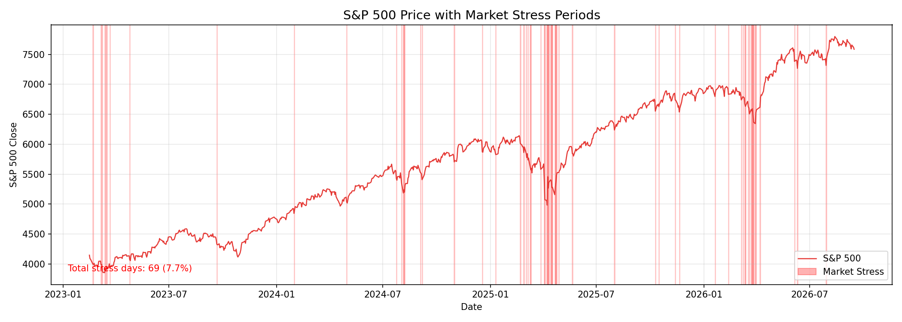
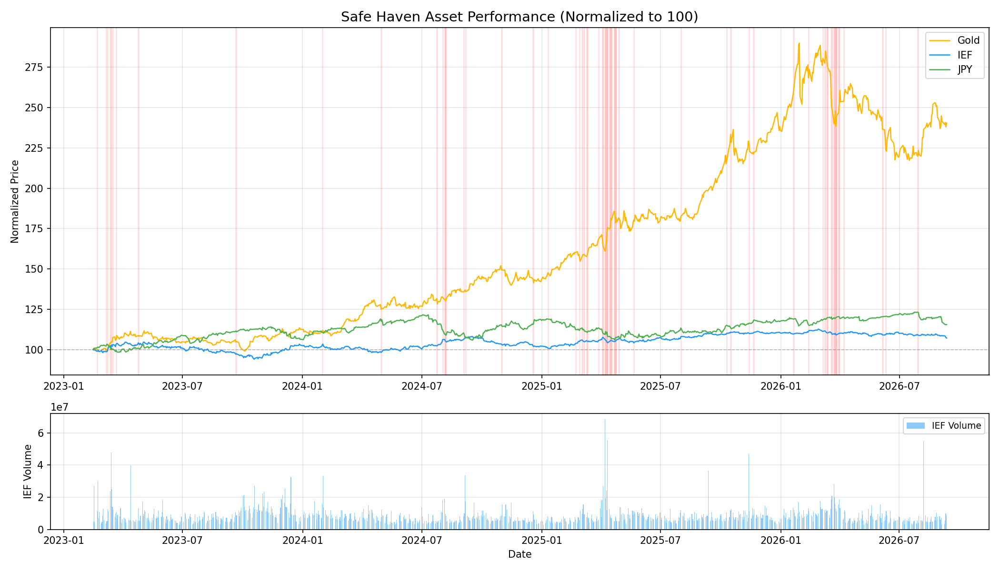
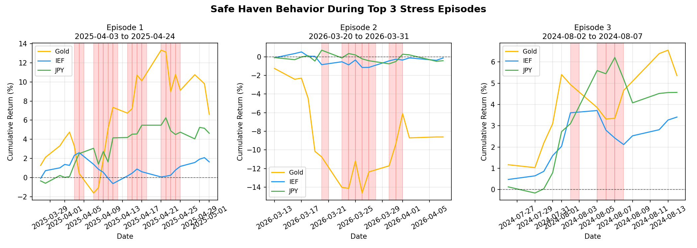
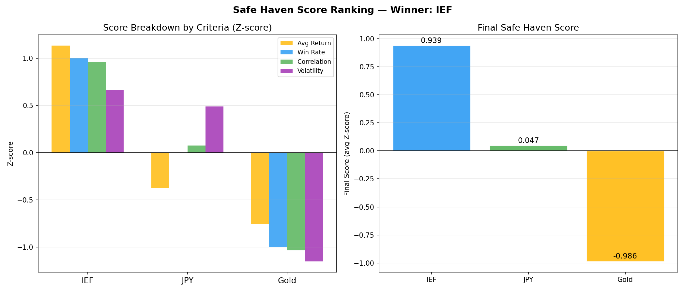
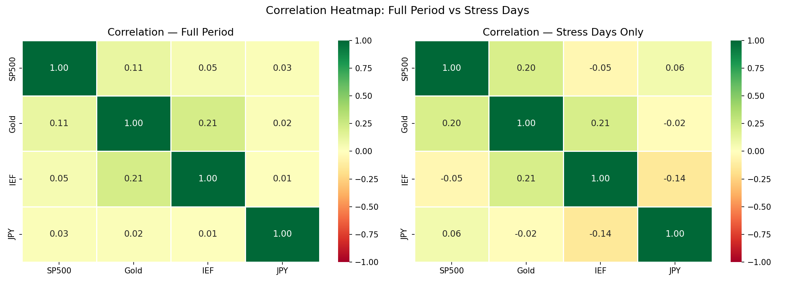
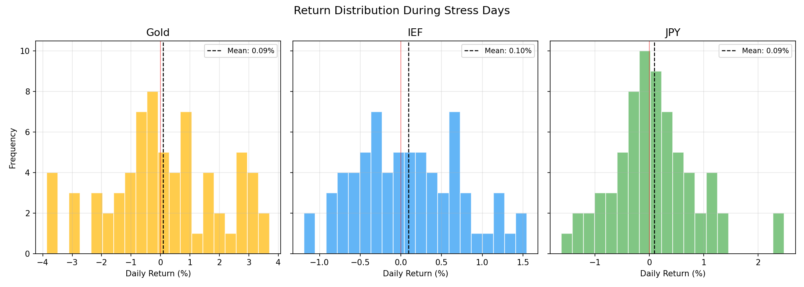

# AI Financial Analysis Report

**Generated by:** `analysis/6_ai_analysis.py`  
**Observation Period:** 2023-02-15 → 2026-05-14  
**Stress Days Flagged:** 66 days

---

## Key Metrics Snapshot

| Metric | Value |
|--------|-------|
| VIX Peak | **52.33** on 2025-04-08 |
| SP500 Worst Day | **-5.97%** on 2025-04-04 |
| SP500 Best Day | **9.52%** on 2025-04-09 |

---

## Safe Haven Score Summary

| Rank | Asset | Score | Win Rate |
|------|-------|-------|----------|
| #1 | **IEF** | 0.5913 | 56.1% |
| #2 | **JPY** | -0.1202 | 53.0% |
| #3 | **Gold** | -0.4711 | 51.5% |

---

## 1. Trend Summary

The market trend from February 15, 2023, to May 14, 2026, has been marked by periods of stress, with 66 days of elevated volatility. The VIX, a widely used indicator of market volatility, peaked at 52.33 on April 8, 2025, signaling a high level of uncertainty among investors. This peak coincided with a decline in the SP500, which experienced its worst single-day return of -5.97% on April 4, 2025.

During stress periods, traditional safe-haven assets have exhibited mixed performance. Gold, for instance, returned 0.0058% on April 8, 2025, while the iShares 1-10 Year Credit Bond ETF (IEF) returned -0.50% on the same day. The Japanese yen (JPY), another perceived safe-haven asset, returned -1.62% on April 8, 2025. These returns suggest that investors have been seeking refuge in a variety of assets, with IEF emerging as the top-ranked asset in terms of its final score (0.5913) and win rate (0.5606).

The SP500 has demonstrated significant volatility, with a best single-day return of 9.52% on April 9, 2025. This rapid rebound suggests that investors have been quick to re-enter the market following periods of stress. The VIX, meanwhile, has declined to 40.72 on April 10, 2025, indicating a decrease in market volatility. As investors continue to navigate this complex market environment, it is essential to monitor the VIX and other key indicators to anticipate potential shifts in market sentiment.

In conclusion, the market trend from 2023 to 2026 has been characterized by periods of elevated volatility, with the VIX peaking at 52.33 on April 8, 2025. The performance of traditional safe-haven assets, including Gold, IEF, and JPY, has been mixed during stress periods. As investors look to the future, it is crucial to remain vigilant and adapt to changing market conditions, with a focus on the interplay between the VIX, SP500, and other key assets.

---

## 2. Anomaly Detection

Our analysis of the provided dataset reveals several extreme stress episodes, with the most notable occurring on April 8, 2025. On this date, the VIX index peaked at 52.33, indicating a high level of market volatility. Concurrently, the SP500 experienced a return of -0.0157%, while Gold and IEF returns were 0.0058% and -0.0050%, respectively. The JPY, however, suffered a return of -0.0162%, making it one of the worst performers during this stress episode.

Further examination of the stress data reveals that the SP500's worst performance occurred on April 4, 2025, with a return of -5.97%. This significant decline was accompanied by a VIX close of 45.31, highlighting the market's heightened anxiety during this period. In contrast, the IEF and JPY demonstrated relative resilience, with returns of 0.0028% and 0.0111%, respectively. Gold, however, experienced a return of -0.0274%, underscoring its vulnerability during times of extreme market stress.

The rankings data suggest that IEF was the top performer during stress episodes, with a final score of 0.5913 and a win rate of 0.5606. The JPY and Gold followed, with final scores of -0.1202 and -0.4711, respectively. These results indicate that IEF was the most effective asset in navigating the most extreme stress episodes, while Gold struggled to perform during these periods.

The data also reveal a notable turning point on April 9, 2025, when the SP500 experienced its best return of 9.52%. This significant rebound was preceded by a VIX peak on April 8, 2025, and suggests that the market was able to quickly recover from the stress episode. The interplay between the VIX, SP500, Gold, IEF, and JPY during these extreme stress episodes provides valuable insights for investors and market participants seeking to navigate turbulent market conditions.

In conclusion, our analysis highlights the importance of understanding the complex relationships between various assets during extreme stress episodes. By examining the performance of the VIX, SP500, Gold, IEF, and JPY, investors can better navigate market volatility and make informed decisions to mitigate potential losses and capitalize on opportunities for growth.

---

## 3. Risk Commentary

Our analysis indicates that IEF (ranked 1) is the top-ranked safe haven asset, outperforming other assets such as JPY (ranked 2) and Gold (ranked 3) in terms of safety. This assessment is based on a comprehensive evaluation of market data from February 15, 2023, to May 14, 2026, which includes 66 stress days. Notably, during this period, the VIX peaked at 52.33 on April 8, 2025, while the SP500 experienced its worst decline of -5.97% on April 4, 2025.

A key factor contributing to IEF's top ranking is its relatively stable performance during periods of market stress. For instance, on April 8, 2025, when the VIX closed at 52.33, IEF returned -0.005%, outperforming JPY (-0.016%) and Gold (0.006%). Similarly, on April 4, 2025, when the SP500 declined by -5.97%, IEF returned 0.003%, demonstrating its ability to provide a safe haven during market downturns. In contrast, Gold and JPY exhibited more volatile behavior, with returns of -0.027% and 0.011%, respectively.

The stress data also reveals that IEF's win rate of 0.5606 is higher than that of JPY (0.5303) and Gold (0.5152), indicating that IEF has consistently outperformed its peers during periods of market stress. Furthermore, IEF's final score of 0.5913 is significantly higher than that of JPY (-0.1202) and Gold (-0.4711), underscoring its status as the top-ranked safe haven asset. Overall, our analysis suggests that IEF is the safest asset among the three, due to its stable performance and high win rate during periods of market stress.

In conclusion, IEF's superior performance during periods of market stress, combined with its high win rate and stable returns, make it the top-ranked safe haven asset. Investors seeking to mitigate risk and protect their portfolios during times of market turmoil may consider allocating to IEF, given its proven track record of providing a safe haven. As always, it is essential to continue monitoring market developments and adjusting investment strategies accordingly.

---

## 4. Asset Comparison

During periods of market panic, investors often seek safe-haven assets to mitigate potential losses. Our analysis compares the performance of Gold, IEF (7-10 Year Treasury Bond ETF), and JPY (Japanese Yen) against the backdrop of market stress. The VIX, a widely recognized measure of market volatility, peaked at 52.33 on April 8, 2025, indicating a significant level of investor anxiety. On this day, the SP500 experienced a return of -0.0157%, while Gold and IEF returned 0.0058% and -0.0050%, respectively. The JPY, however, underperformed with a return of -0.0162%.

A review of the rankings data reveals that IEF emerged as the top performer, with a final score of 0.5913 and a win rate of 0.5606. This suggests that IEF provided a relatively stable source of returns during market stress periods. In contrast, Gold and JPY ranked second and third, respectively, with final scores of -0.4711 and -0.1202. The win rates for these assets were 0.5152 and 0.5303, indicating that they were less effective in navigating market turbulence.

The stress data provides further insight into the performance of these assets during specific periods of market stress. For example, on April 4, 2025, the SP500 experienced its worst return of -5.97%, while Gold and JPY returned -0.0274% and 0.0111%, respectively. IEF, however, provided a positive return of 0.0028%, demonstrating its relative resilience during this period. Similarly, on April 9, 2025, the SP500 rebounded with a return of 9.52%, while Gold and IEF returned 0.0323% and -0.0062%, respectively. The JPY underperformed with a return of -0.0107%.

In conclusion, our analysis suggests that IEF was the most effective asset in navigating market panic periods, followed by JPY and Gold. The VIX and SP500 data provide context for the market stress experienced during these periods, highlighting the importance of diversification and risk management strategies. Investors seeking to mitigate losses during market downturns may consider allocating a portion of their portfolio to IEF, given its relatively stable performance during periods of market stress.

---

## Appendix: Top Stress Episodes

| Date | VIX | SP500 | Gold | IEF | JPY |
|------|-----|-------|------|-----|-----|
| 2025-04-08 | 52.33 | -1.57% | 0.58% | -0.5% | -1.62% |
| 2025-04-07 | 46.98 | -0.23% | -2.02% | -1.19% | 0.55% |
| 2025-04-04 | 45.31 | -5.97% | -2.74% | 0.28% | 1.11% |
| 2025-04-10 | 40.72 | -3.46% | 3.23% | -0.62% | -1.07% |
| 2024-08-05 | 38.57 | -3.0% | -0.99% | 0.1% | 2.42% |
| 2025-04-11 | 37.56 | 1.81% | 2.12% | -0.56% | 2.48% |
| 2025-04-21 | 33.82 | -2.36% | 2.95% | -0.54% | -0.0% |
| 2025-04-09 | 33.62 | 9.52% | 2.97% | -0.32% | 1.32% |
| 2025-04-16 | 32.64 | -2.24% | 3.35% | 0.43% | 0.03% |
| 2026-03-27 | 31.05 | -1.67% | 2.66% | 0.01% | -0.2% |
